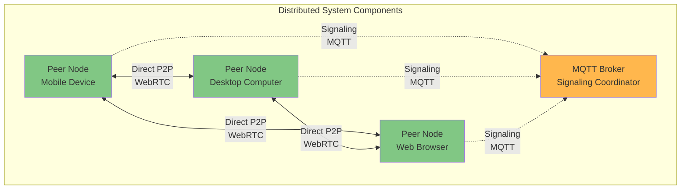

# P2P Chat Application - Flutter Implementation

## Academic Overview

This document describes the Flutter/Dart implementation of a peer-to-peer chat application, designed to demonstrate distributed systems concepts across multiple platforms. This cross-platform implementation serves as a case study for understanding how distributed systems principles apply to mobile, desktop, and web environments.

---

## Distributed Systems Architecture

### System Classification

This application is a **hybrid distributed system** with:
- **Decentralized data transfer**: Peer-to-peer WebRTC connections
- **Centralized signaling**: MQTT broker for connection establishment
- **Eventually consistent storage**: Local SQLite database per peer
- **Cross-platform deployment**: Single codebase, multiple platforms

### Architectural Principles



**Key Distributed Systems Properties**:
- **Autonomy**: Each peer operates independently
- **Heterogeneity**: Cross-platform (Android, iOS, Web, Linux, Windows, macOS)
- **Asynchrony**: Non-blocking message passing
- **Partial Failures**: System continues despite node failures
- **No Shared Memory**: Message-based communication only
- **Platform Independence**: Same distributed logic across platforms

---

## Technology Stack (Distributed Systems Perspective)

| Component | Technology | Distributed Systems Role |
|-----------|-----------|--------------------------|
| **Application Framework** | Flutter SDK | Cross-platform UI, single codebase |
| **Programming Language** | Dart 3.10.1+ | Type-safe, compiled to native |
| **State Management** | Riverpod 2.4.9 | Reactive state propagation |
| **Signaling Protocol** | mqtt_client 10.2.0 | Reliable publish-subscribe messaging |
| **P2P Protocol** | flutter_webrtc 0.9.48 | Direct peer-to-peer data transfer |
| **Local Storage** | Drift 2.14.0 (SQLite) | Type-safe, eventually consistent database |
| **Code Generation** | build_runner 2.4.7 | Compile-time code generation |

### Protocol Selection Rationale

**MQTT for Signaling**:
- Publish-subscribe decoupling
- QoS 1 (at-least-once delivery)
- Lightweight, low overhead
- Persistent sessions for fault tolerance
- Cross-platform support

**WebRTC for Data Transfer**:
- Direct P2P (no server intermediary)
- NAT traversal (STUN/TURN)
- Low latency (no broker hop)
- Built-in encryption (DTLS)
- Native support on all platforms

**Drift (SQLite) for Storage**:
- Type-safe SQL queries
- Reactive streams for UI updates
- ACID transactions
- Cross-platform persistence
- Efficient local storage

---

## Core Distributed Systems Concepts

### 1. Service Discovery (MQTT Topics)

Peers discover each other through MQTT topic subscriptions:

```
Topic Structure:
user/{userId}/
├── offer              # WebRTC connection offers
├── answer             # WebRTC connection answers
├── iceCandidate       # ICE candidates for NAT traversal
├── contactRequest     # Peer relationship requests
└── presence           # Liveness/availability signals
```

### 2. Consensus (Polite Peer Pattern)

When both peers simultaneously initiate connection (glare condition):
- **Deterministic resolution**: Lexicographic comparison of peer IDs
- **No coordinator needed**: Peers resolve conflict independently
- **Symmetric algorithm**: Both run identical logic
- **Platform-independent**: Same logic on all platforms

### 3. Fault Tolerance

**Failure Detection**: Heartbeat mechanism
**Recovery**: Exponential backoff retry (1s, 2s, 4s, 8s, 16s, 32s max)
**Graceful Degradation**: Offline message queuing
**Platform Resilience**: Handles platform-specific failures

### 4. Consistency Model

**Eventually Consistent**: CAP theorem choice of AP (Availability + Partition Tolerance)
- Each peer maintains local SQLite database
- Messages sync when connection available
- Temporary inconsistency acceptable
- Reactive UI updates via Drift streams

---

## System Components (Layered Architecture)

### Layer 1: Presentation (Flutter Widgets)
- **Responsibility**: Cross-platform UI rendering
- **State**: Reactive state via Riverpod
- **Distribution**: None (single-node)
- **Platforms**: Android, iOS, Web, Linux, Windows, macOS

### Layer 2: State Management (Riverpod)
- **Responsibility**: Reactive state propagation
- **Pattern**: Provider pattern with dependency injection
- **Distribution**: Coordinates distributed operations
- **Reactivity**: Automatic UI updates on state changes

### Layer 3: Coordination (ChatCoordinator)
- **Responsibility**: Service orchestration
- **Pattern**: Facade pattern for service layer
- **Distribution**: Coordinates distributed operations
- **Platform-agnostic**: Same logic across platforms

### Layer 4: Services (Business Logic)

#### SignalingService (MQTT)
- **Protocol**: MQTT over WebSocket
- **QoS**: Level 1 (at-least-once)
- **Reliability**: Automatic reconnection
- **Message Queue**: Pending messages during disconnection
- **Cross-platform**: mqtt_client package

#### WebRtcService (P2P Data)
- **Protocol**: WebRTC (DTLS/SCTP/UDP)
- **Topology**: Mesh network
- **NAT Traversal**: ICE (STUN/TURN)
- **Encryption**: End-to-end (DTLS)
- **Cross-platform**: flutter_webrtc package

#### ConnectionManager
- **Responsibility**: Connection lifecycle
- **Health Monitoring**: Periodic heartbeats
- **Failure Detection**: Timeout-based
- **Recovery**: Automatic reconnection
- **Platform-aware**: Handles platform-specific events

### Layer 5: Repository (Data Persistence)
- **Storage**: Drift (SQLite wrapper)
- **Consistency**: Local, eventually consistent
- **Durability**: Persistent across sessions
- **Reactivity**: Stream-based queries
- **Type Safety**: Compile-time SQL verification

---

## Platform Support

| Platform | Status | Distributed Systems Considerations |
|----------|--------|-----------------------------------|
| **Android** | ✅ Full Support | Background services, battery optimization |
| **iOS** | ✅ Full Support | Background limitations, app lifecycle |
| **Web** | ✅ Full Support | Browser WebRTC, IndexedDB fallback |
| **Linux** | ✅ Full Support | Native WebRTC, full background support |
| **Windows** | ✅ Full Support | Native WebRTC, full background support |
| **macOS** | ✅ Full Support | Native WebRTC, full background support |

**Cross-Platform Challenges**:
- **Network Permissions**: Platform-specific permission models
- **Background Execution**: Different lifecycle management
- **Storage Paths**: Platform-specific file system access
- **WebRTC Support**: Native vs browser implementations

---

## Distributed Systems Challenges Addressed

### Challenge: NAT Traversal
**Problem**: Peers behind NAT/firewall cannot directly connect
**Solution**: ICE framework with STUN/TURN servers
**Result**: ~80% direct connections, ~20% relayed
**Platform Impact**: Works consistently across all platforms

### Challenge: Message Ordering
**Problem**: Network may reorder packets
**Solution**: Timestamp-based ordering in Drift database
**Result**: Causal consistency maintained

### Challenge: Partial Failures
**Problem**: Network or peer failures
**Solution**: Retry with exponential backoff, message queuing
**Result**: Eventual delivery guarantee

### Challenge: Platform Heterogeneity
**Problem**: Different platforms, same distributed system
**Solution**: Abstraction layers, platform channels
**Result**: Consistent behavior across platforms

---

## Performance Characteristics

### Latency
- **Signaling**: ~100-500ms (via MQTT broker)
- **P2P Data**: ~10-50ms (direct connection)
- **Database Queries**: ~1-5ms (local SQLite)
- **UI Updates**: ~16ms (60 FPS reactive updates)

### Scalability
- **Broker Load**: O(N) - linear with number of peers
- **Data Transfer**: O(1) - peer-to-peer, no broker involvement
- **Database**: O(log N) - indexed queries
- **Comparison**: Traditional client-server is O(N^2)

### Reliability
- **Message Delivery**: At-least-once (MQTT QoS 1)
- **Connection Success**: ~95% (with TURN fallback)
- **Fault Recovery**: Automatic within 60 seconds
- **Data Persistence**: ACID guarantees (SQLite)

---

## Setup Instructions

### Prerequisites
- Flutter SDK 3.10.1+
- Dart SDK 3.10.1+
- MQTT Broker (e.g., Mosquitto, EMQX)
- Platform-specific tools (Android Studio, Xcode, etc.)

### Installation
```bash
cd p2p_chat_flutter
flutter pub get
```

### Code Generation
```bash
flutter pub run build_runner build --delete-conflicting-outputs
```

### Configuration
Update MQTT broker URL in `lib/services/mqtt_service.dart`:
```dart
const BROKER_URL = 'ws://your-broker:9001';
```

### Running
```bash
# Android
flutter run -d android

# iOS
flutter run -d ios

# Web
flutter run -d chrome

# Desktop
flutter run -d linux
flutter run -d windows
flutter run -d macos
```

---

## Academic Significance

This implementation demonstrates:

1. **Cross-Platform Distributed Systems**: Same distributed logic across 6 platforms
2. **Hybrid Architecture**: Combining centralized and decentralized approaches
3. **Protocol Layering**: MQTT for control plane, WebRTC for data plane
4. **CAP Theorem Trade-offs**: Choosing AP over C for chat use case
5. **Consensus Algorithms**: Distributed conflict resolution
6. **Fault Tolerance**: Retry mechanisms and graceful degradation
7. **Network Transparency**: Hiding NAT/firewall complexity
8. **Eventual Consistency**: Accepting temporary inconsistency for availability
9. **Reactive Programming**: Stream-based state propagation
10. **Type Safety**: Compile-time verification of distributed operations

---

## Sequence Diagrams

For detailed interaction flows demonstrating distributed systems concepts, see:
- **`sequence-diagrams.md`**: Complete temporal interactions
  - System initialization and bootstrapping
  - Peer discovery via publish-subscribe
  - WebRTC connection establishment
  - Message transmission and acknowledgment
  - Failure detection and recovery
  - Glare resolution (distributed consensus)
  - Message queuing during network partitions
  - Presence and liveness detection

---

## Further Study

For deeper understanding of distributed systems concepts:
- See `DISTRIBUTED_SYSTEMS_OVERVIEW.md` for theoretical foundation
- See `DISTRIBUTED_SYSTEMS_DIAGRAMS.md` for visual explanations
- See `sequence-diagrams.md` for detailed interaction flows
- See `component-architecture.md` for system structure
- See `communication-flow.md` for protocol details

---

**Note**: This implementation prioritizes clarity, cross-platform consistency, and educational value. It serves as a learning tool for distributed systems concepts across multiple platforms.
