# Communication Flow - Flutter P2P Chat

## Overview

The Flutter P2P chat application uses the same hybrid communication model as the React version, combining MQTT for signaling and WebRTC for data transfer. This document details the Flutter-specific implementation.

## Communication Layers

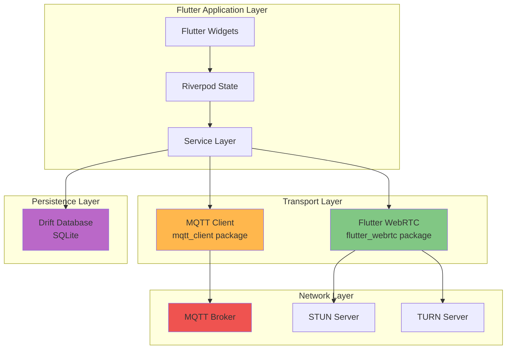

## 1. Flutter-Specific Architecture

### Widget Tree

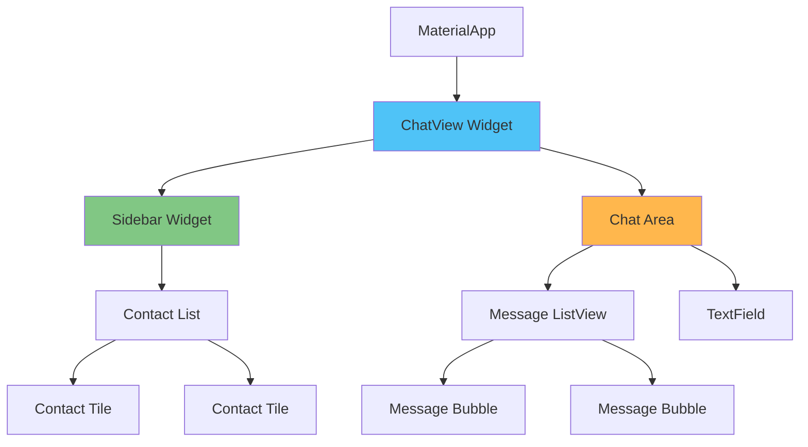

### Riverpod State Flow

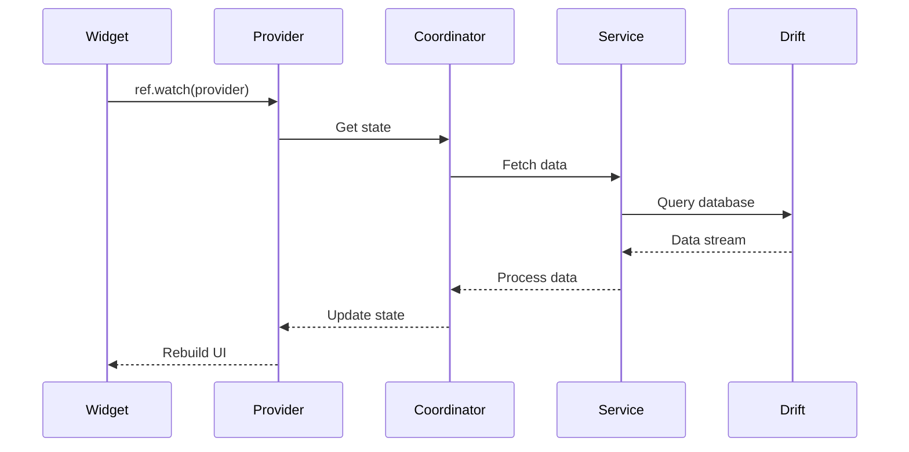

## 2. MQTT Signaling (Flutter Implementation)

### MQTT Client Configuration

```dart
// Flutter-specific MQTT setup
final client = MqttServerClient('ws://localhost', '');
client.port = 9001;
client.websocketProtocols = ['mqtt'];
client.logging(on: true);
client.keepAlivePeriod = 60;
client.onConnected = onConnected;
client.onDisconnected = onDisconnected;
client.onSubscribed = onSubscribed;
```

### Message Flow with Riverpod

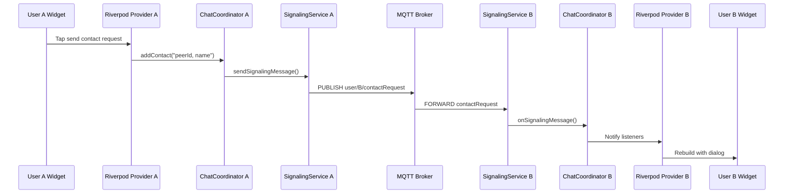

## 3. WebRTC Connection (Flutter Implementation)

### RTCPeerConnection Setup

```dart
// Flutter WebRTC configuration
final configuration = {
  'iceServers': [
    {'urls': 'stun:stun.l.google.com:19302'},
    {'urls': 'stun:stun1.l.google.com:19302'},
  ],
  'sdpSemantics': 'unified-plan',
};

final pc = await createPeerConnection(configuration);
```

### Data Channel Creation

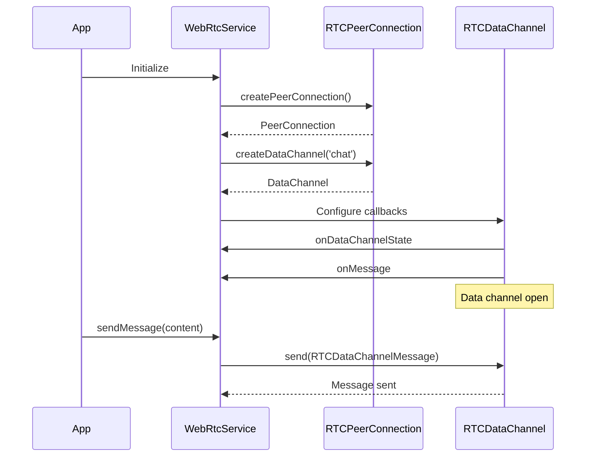

### Polite Peer Pattern (Flutter)

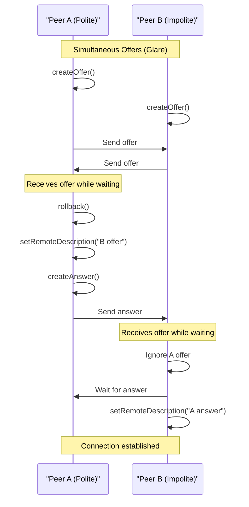

## 4. Data Persistence (Drift)

### Database Schema

```dart
@DataClassName('MessageData')
class Messages extends Table {
  TextColumn get id => text()();
  TextColumn get userId => text()();
  TextColumn get contactId => text()();
  TextColumn get content => text()();
  DateTimeColumn get timestamp => dateTime()();
  BoolColumn get isSent => boolean()();
  TextColumn get status => text()();
  
  @override
  Set<Column> get primaryKey => {id};
}

@DataClassName('ContactData')
class Contacts extends Table {
  TextColumn get id => text()();
  TextColumn get name => text()();
  TextColumn get status => text()();
  BoolColumn get isDeleted => boolean().withDefault(const Constant(false))();
  DateTimeColumn get createdAt => dateTime()();
  DateTimeColumn get updatedAt => dateTime()();
  
  @override
  Set<Column> get primaryKey => {id};
}
```

### Reactive Queries

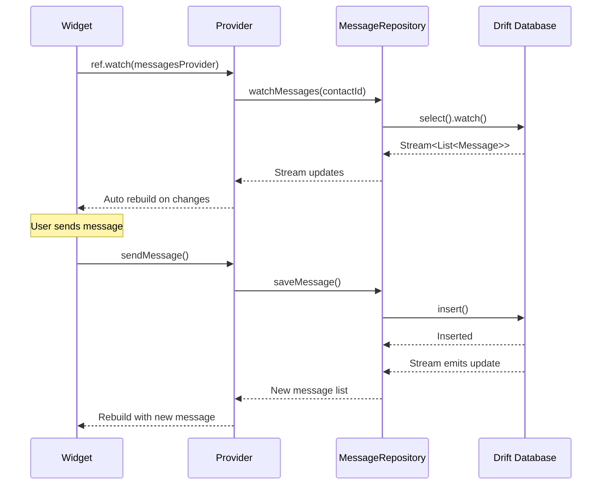

## 5. Message Send Flow (Flutter)

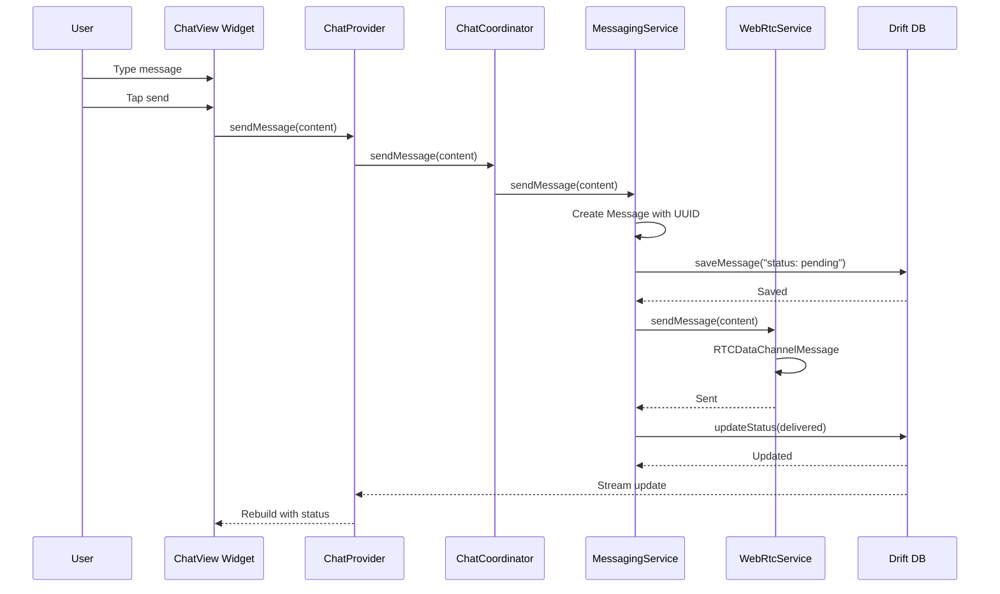

## 6. Connection Lifecycle (Flutter)

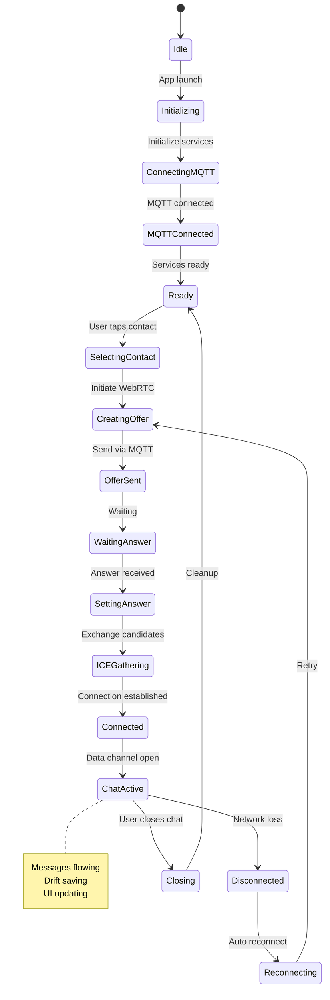

## 7. Error Handling (Flutter)

### Retry with Exponential Backoff

```dart
class RetryHelper {
  static Future<T> withRetry<T>({
    required Future<T> Function() operation,
    int maxAttempts = 5,
    Duration initialDelay = const Duration(seconds: 1),
    double backoffMultiplier = 2.0,
  }) async {
    int attempt = 0;
    Duration delay = initialDelay;
    
    while (attempt < maxAttempts) {
      try {
        return await operation();
      } catch (e) {
        attempt++;
        if (attempt >= maxAttempts) rethrow;
        
        await Future.delayed(delay);
        delay *= backoffMultiplier;
      }
    }
    throw Exception('Max retries reached');
  }
}
```

### Error Flow

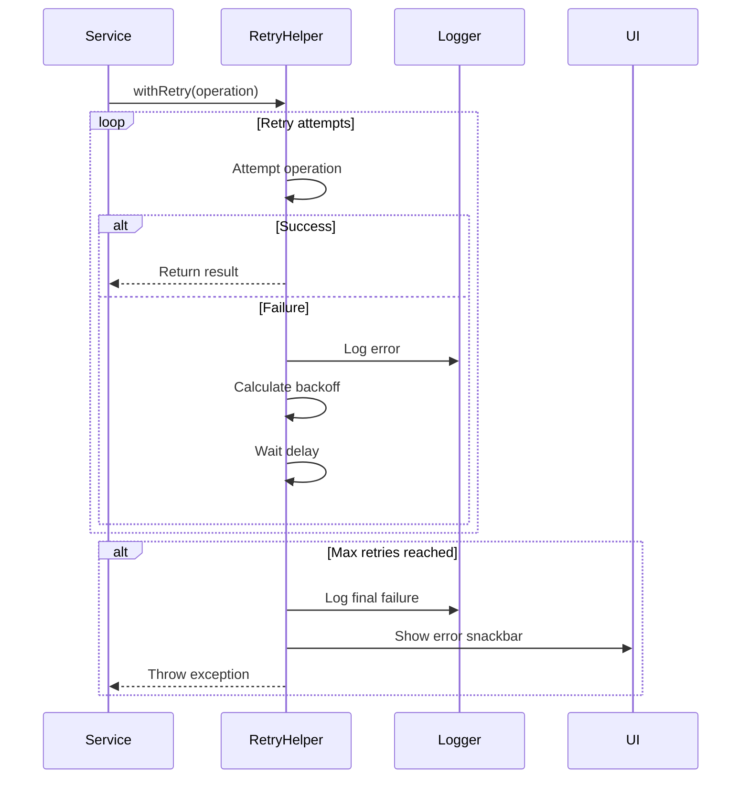

## 8. Platform-Specific Considerations

### Android

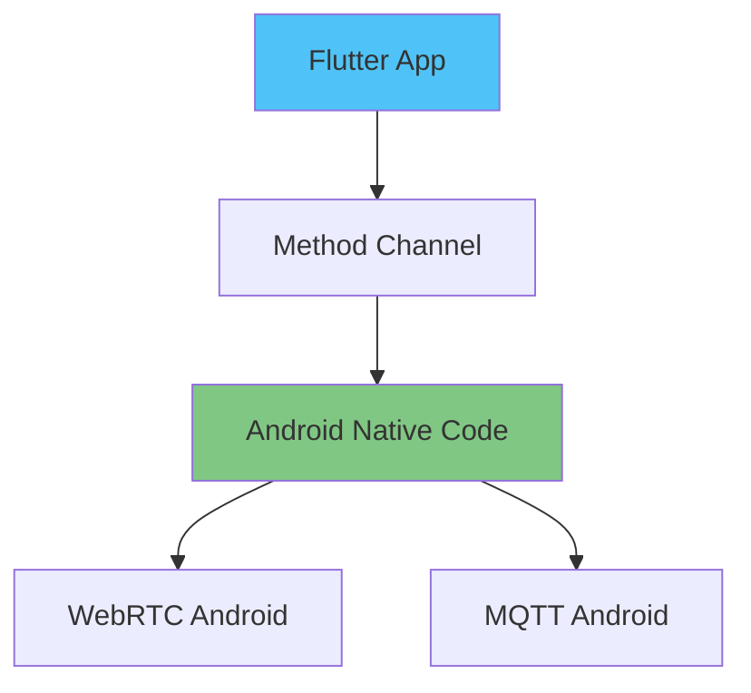

### iOS

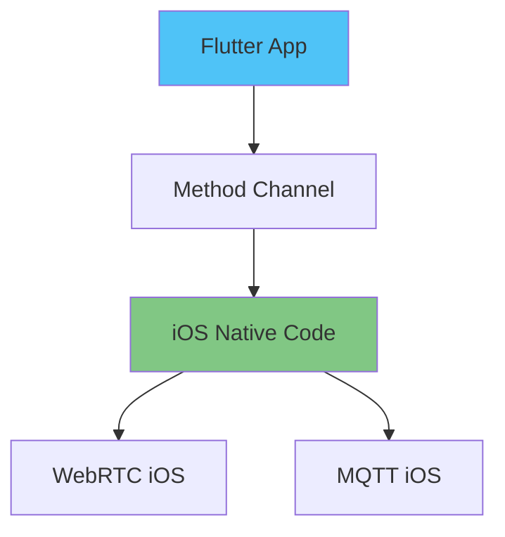

### Desktop (Linux/Windows/macOS)

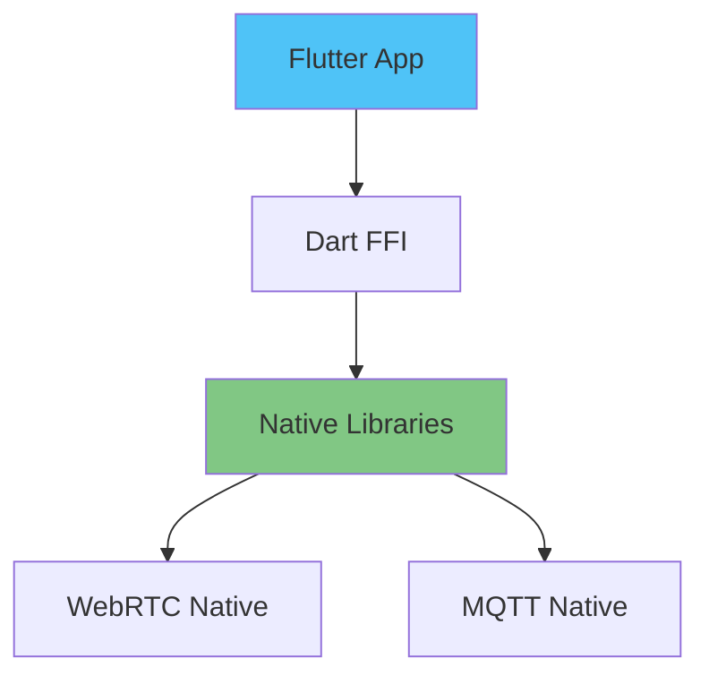

### Web

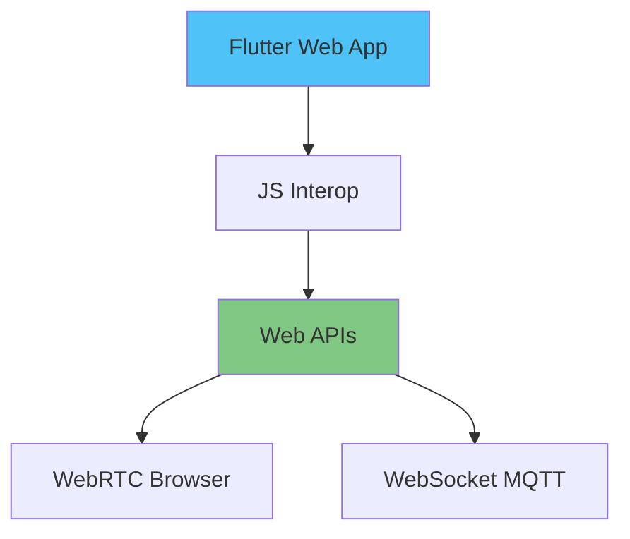

## 9. Performance Optimizations

### Message Pagination

```dart
// Drift query with pagination
Stream<List<Message>> watchMessages(String contactId, {int limit = 50}) {
  return (select(messages)
    ..where((m) => m.contactId.equals(contactId))
    ..orderBy([(m) => OrderingTerm.desc(m.timestamp)])
    ..limit(limit))
    .watch();
}
```

### Lazy Loading

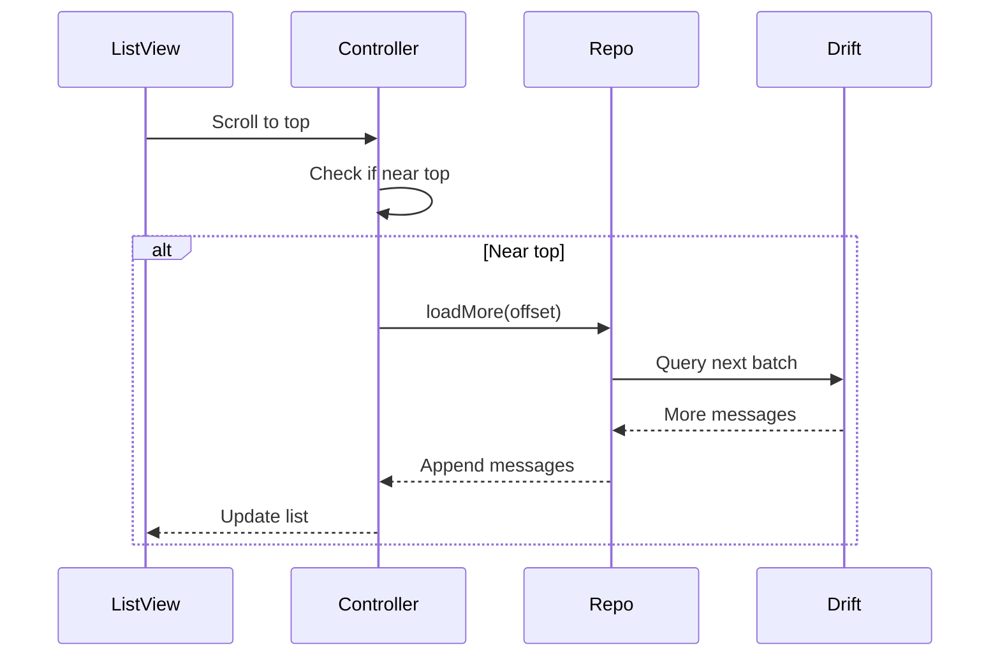

## 10. Security (Flutter)

### Encryption Layers

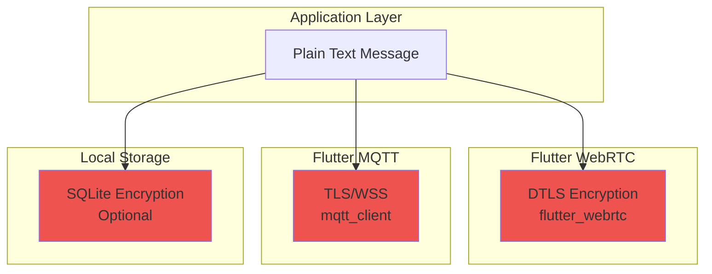

## Summary

The Flutter implementation provides:

1. **Cross-platform support**: Single codebase for all platforms
2. **Reactive UI**: Riverpod for state management
3. **Type-safe database**: Drift with compile-time SQL verification
4. **Native performance**: Platform-specific optimizations
5. **Robust error handling**: Retry logic with exponential backoff
6. **Offline support**: Local database with sync
7. **Real-time updates**: Stream-based architecture
8. **Polite peer pattern**: Robust WebRTC negotiation

This architecture ensures a consistent, performant, and reliable chat experience across all supported platforms.
