# Component Architecture - Flutter P2P Chat

## System Architecture Overview

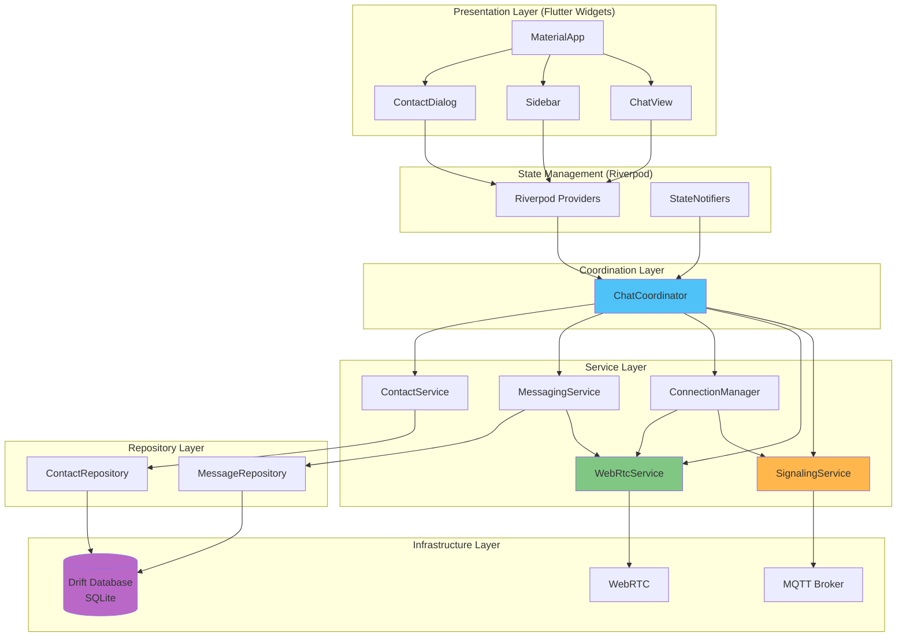

## 1. Presentation Layer

### Widget Hierarchy

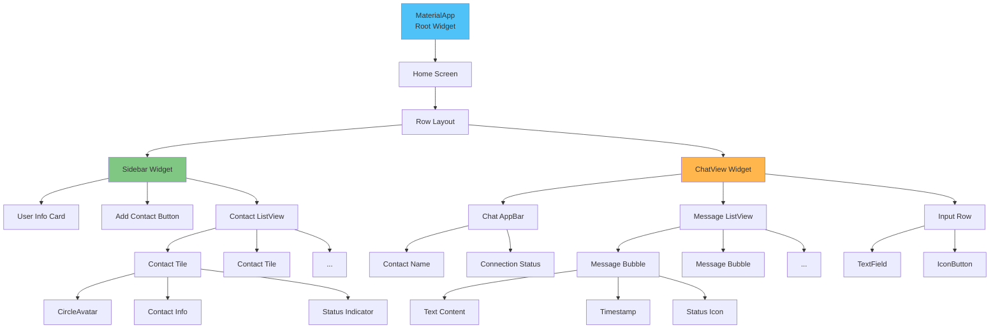

### ChatView Widget

```dart
class ChatView extends ConsumerStatefulWidget {
  const ChatView({Key? key}) : super(key: key);

  @override
  ConsumerState<ChatView> createState() => _ChatViewState();
}

class _ChatViewState extends ConsumerState<ChatView> {
  final _messageController = TextEditingController();
  final _scrollController = ScrollController();

  @override
  Widget build(BuildContext context) {
    // Watch providers for reactive updates
    final selectedContact = ref.watch(selectedContactProvider);
    final messages = ref.watch(messagesProvider(selectedContact?.id ?? ''));
    final connectionStatus = ref.watch(connectionStatusProvider);
    
    return Column(
      children: [
        _buildAppBar(selectedContact, connectionStatus),
        Expanded(
          child: _buildMessageList(messages),
        ),
        _buildInputRow(),
      ],
    );
  }
}
```

## 2. State Management (Riverpod)

### Provider Architecture

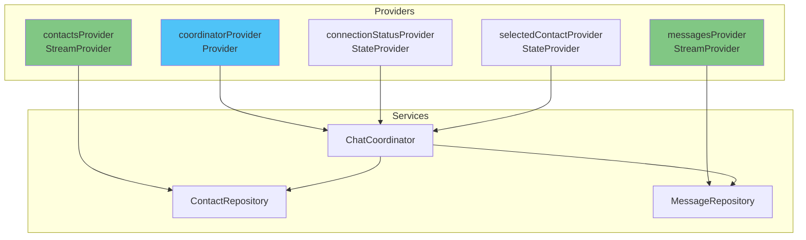

### Provider Definitions

```dart
// Coordinator provider
final coordinatorProvider = Provider<ChatCoordinator>((ref) {
  return ChatCoordinator(
    signalingService: ref.watch(signalingServiceProvider),
    webrtcService: ref.watch(webrtcServiceProvider),
    messageRepository: ref.watch(messageRepositoryProvider),
    contactRepository: ref.watch(contactRepositoryProvider),
    connectionManager: ref.watch(connectionManagerProvider),
    messagingService: ref.watch(messagingServiceProvider),
    contactService: ref.watch(contactServiceProvider),
    userId: ref.watch(userIdProvider),
  );
});

// Contacts stream provider
final contactsProvider = StreamProvider<List<Contact>>((ref) {
  final repo = ref.watch(contactRepositoryProvider);
  return repo.watchAll();
});

// Messages stream provider (family)
final messagesProvider = StreamProvider.family<List<Message>, String>((ref, contactId) {
  final repo = ref.watch(messageRepositoryProvider);
  return repo.watchMessages(contactId);
});

// Connection status provider
final connectionStatusProvider = StateProvider<String>((ref) => 'Disconnected');

// Selected contact provider
final selectedContactProvider = StateProvider<Contact?>((ref) => null);
```

### State Flow

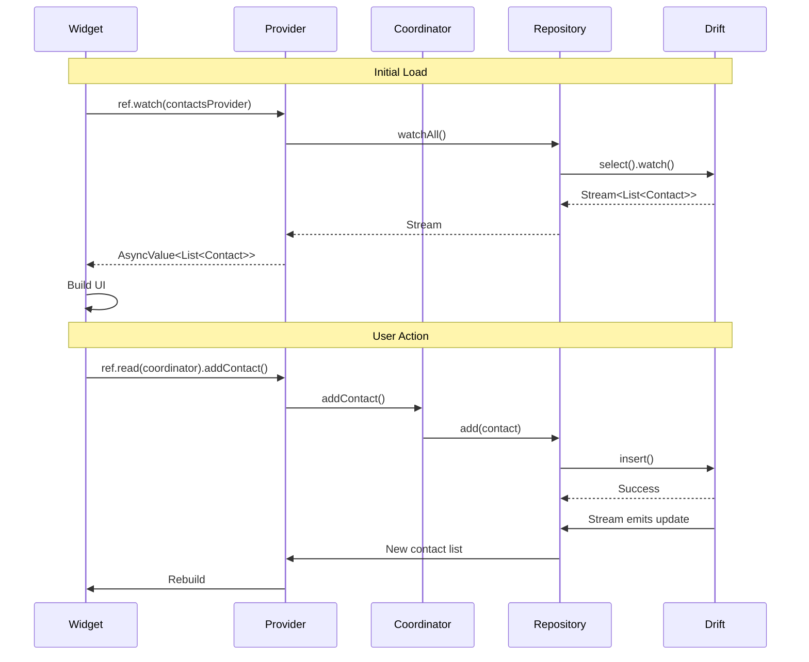

## 3. Service Layer

### ChatCoordinator

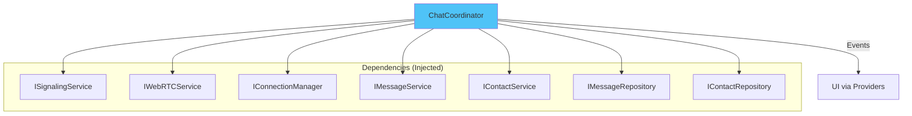

**Key Methods:**
```dart
class ChatCoordinator implements IChatCoordinator {
  Future<bool> initialize();
  Future<void> sendMessage(String content);
  Future<void> selectContact(Contact contact);
  Future<bool> addContact(String peerId, String name);
  Future<void> acceptContact(String peerId, String name);
  Future<void> declineContact(String peerId);
  Future<void> removeContact(String peerId);
  Future<void> dispose();
  
  // Event callbacks
  void onMessageReceived(Function(Message) callback);
  void onConnectionStateChange(Function(String) callback);
  void onContactRequest(Function(String from, String name) callback);
  void onContactResponse(Function(String from, bool accepted, String? name) callback);
}
```

### SignalingService (MQTT)

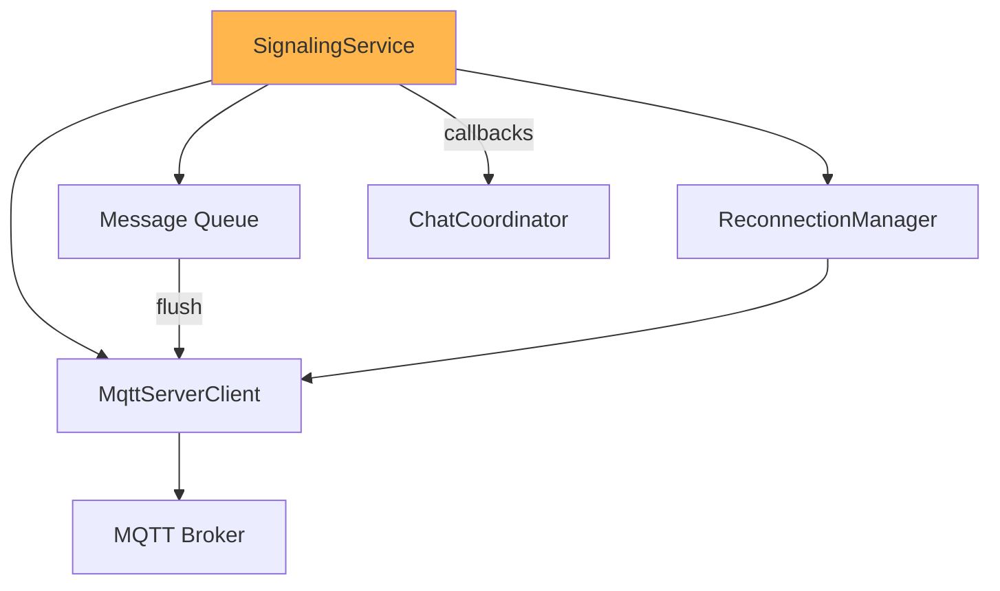

**Implementation:**
```dart
class SignalingService implements ISignalingService {
  late MqttServerClient _client;
  final String _userId;
  final _logger = Logger();
  
  Future<bool> connect() async {
    _client = MqttServerClient('ws://localhost', '');
    _client.port = 9001;
    _client.websocketProtocols = ['mqtt'];
    _client.keepAlivePeriod = 60;
    
    // Setup callbacks
    _client.onConnected = _onConnected;
    _client.onDisconnected = _onDisconnected;
    _client.onSubscribed = _onSubscribed;
    
    await _client.connect();
    return _client.connectionStatus!.state == MqttConnectionState.connected;
  }
  
  Future<void> sendSignalingMessage(SignalingMessage message, String targetId) async {
    final topic = 'user/$targetId/${message.type}';
    final payload = jsonEncode(message.toJson());
    
    final builder = MqttClientPayloadBuilder();
    builder.addString(payload);
    
    _client.publishMessage(topic, MqttQos.atLeastOnce, builder.payload!);
  }
}
```

### WebRtcService

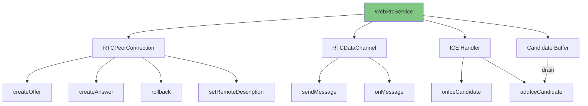

**Key Features:**
```dart
class WebRtcService implements IWebRTCService {
  RTCPeerConnection? _peerConnection;
  RTCDataChannel? _dataChannel;
  final List<RTCIceCandidate> _pendingCandidates = [];
  bool _remoteDescriptionSet = false;
  
  // Polite peer pattern support
  Future<void> rollbackLocalDescription() async {
    await _peerConnection?.setLocalDescription(
      await _peerConnection!.createOffer({'iceRestart': false}),
    );
  }
  
  // ICE candidate buffering
  Future<void> addIceCandidate(dynamic candidate) async {
    if (!_remoteDescriptionSet) {
      _pendingCandidates.add(RTCIceCandidate(
        candidate['candidate'],
        candidate['sdpMid'],
        candidate['sdpMLineIndex'],
      ));
      return;
    }
    
    await _peerConnection?.addCandidate(RTCIceCandidate(
      candidate['candidate'],
      candidate['sdpMid'],
      candidate['sdpMLineIndex'],
    ));
  }
  
  // Drain buffered candidates
  Future<void> _drainPendingCandidates() async {
    for (final candidate in _pendingCandidates) {
      await _peerConnection?.addCandidate(candidate);
    }
    _pendingCandidates.clear();
  }
}
```

## 4. Repository Layer

### MessageRepository

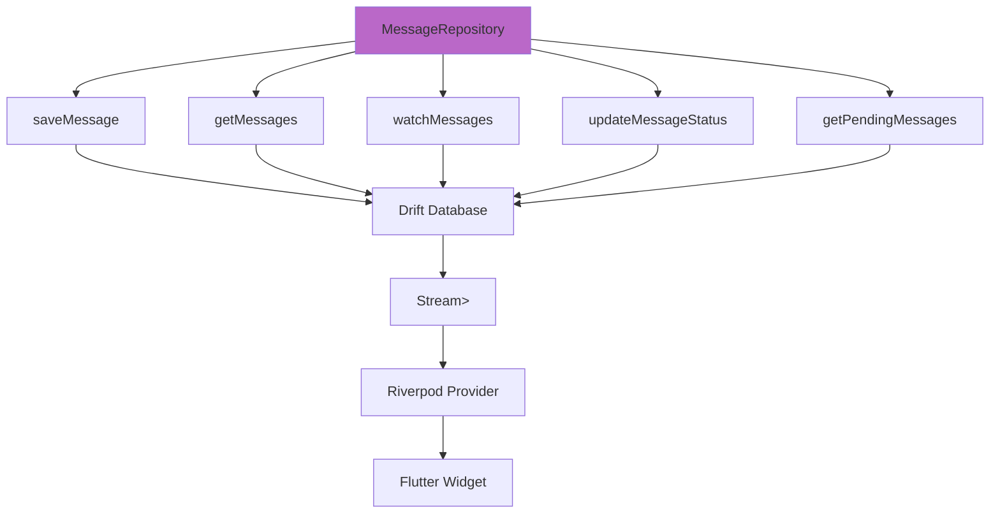

**Implementation:**
```dart
class MessageRepository implements IMessageRepository {
  final AppDatabase _db;
  
  MessageRepository(this._db);
  
  // Save message
  Future<void> saveMessage(
    String userId,
    String contactId,
    models.Message message,
  ) async {
    await _db.into(_db.messages).insert(
      MessagesCompanion.insert(
        id: message.id,
        userId: userId,
        contactId: contactId,
        content: message.content,
        timestamp: message.timestamp,
        isSent: message.isSent,
        status: message.status.toString(),
      ),
    );
  }
  
  // Watch messages (reactive)
  Stream<List<models.Message>> watchMessages(
    String userId,
    String contactId,
  ) {
    return (_db.select(_db.messages)
      ..where((m) => 
        m.userId.equals(userId) & 
        m.contactId.equals(contactId))
      ..orderBy([(m) => OrderingTerm.asc(m.timestamp)]))
      .watch()
      .map((rows) => rows.map((row) => _toMessage(row)).toList());
  }
  
  // Get pending messages
  Future<List<models.Message>> getPendingMessages(
    String userId,
    String contactId,
  ) async {
    final query = _db.select(_db.messages)
      ..where((m) => 
        m.userId.equals(userId) & 
        m.contactId.equals(contactId) &
        m.status.equals('pending'));
    
    final rows = await query.get();
    return rows.map((row) => _toMessage(row)).toList();
  }
}
```

### ContactRepository

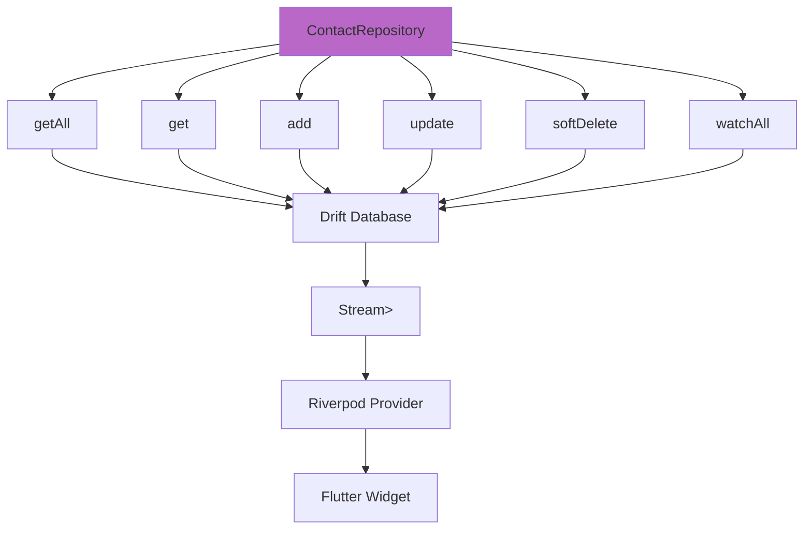

## 5. Data Flow Examples

### Send Message Flow

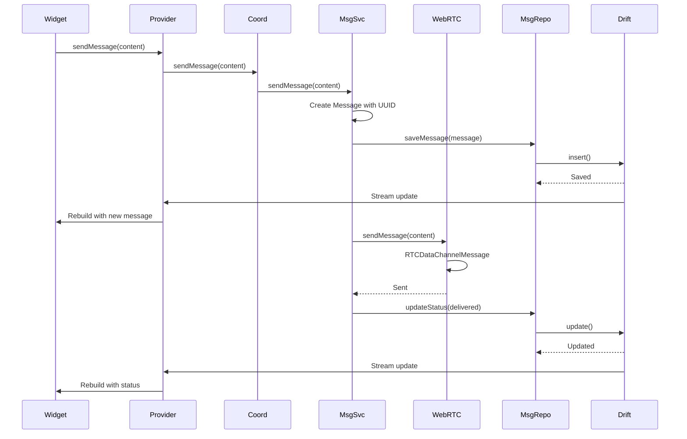

### Receive Message Flow

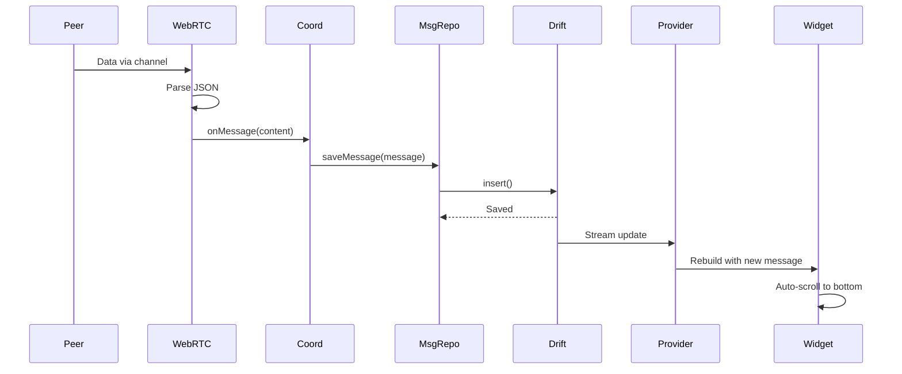

## 6. Cross-Platform Architecture

### Platform Channels

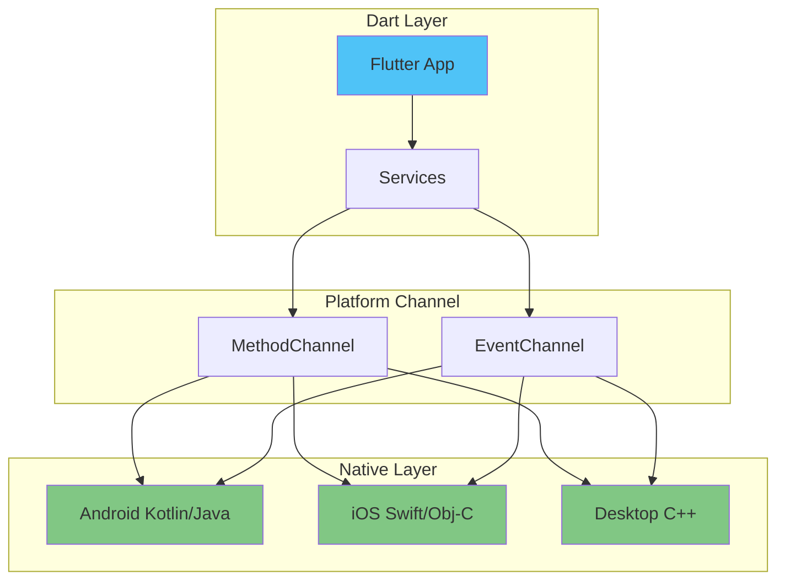

## Summary

The Flutter architecture provides:

1. **Reactive UI**: Riverpod providers for automatic rebuilds
2. **Type Safety**: Drift for compile-time SQL verification
3. **Clean Architecture**: Clear separation of concerns
4. **Dependency Injection**: Provider-based DI
5. **Cross-Platform**: Single codebase for all platforms
6. **Testability**: Interface-based design
7. **Performance**: Native compilation
8. **Offline Support**: Local database with sync
