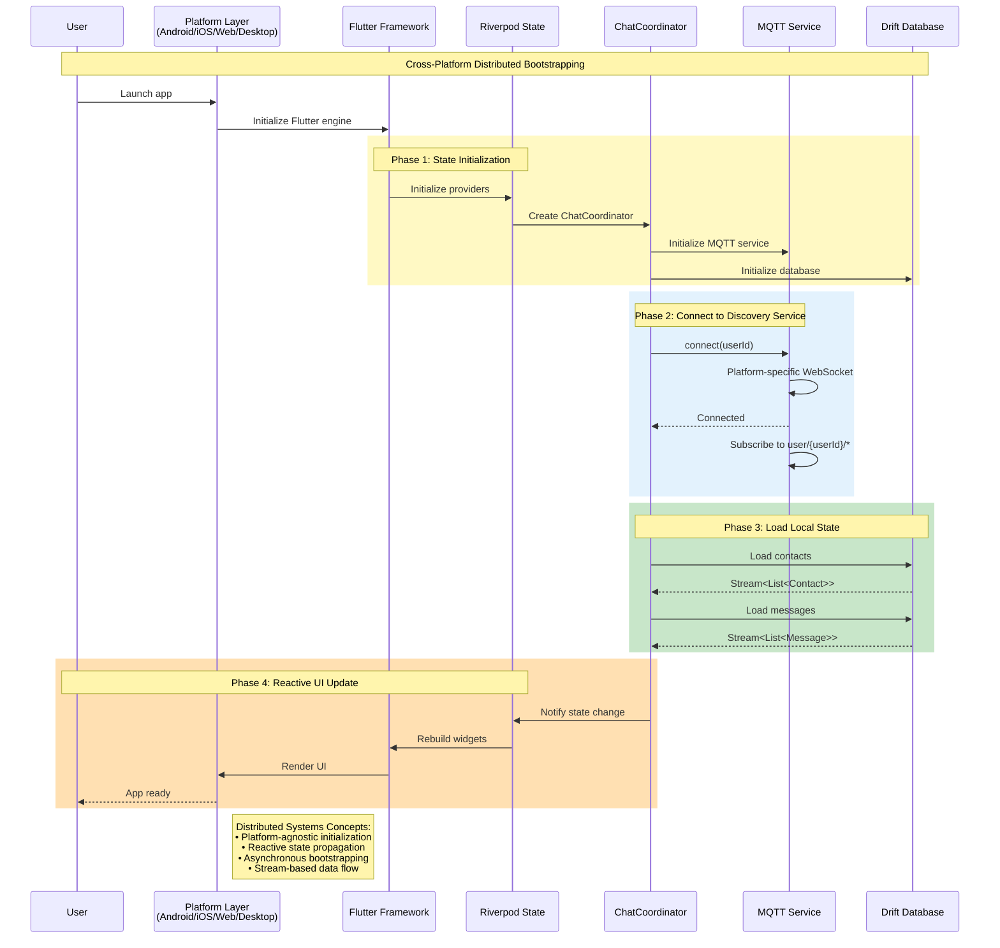
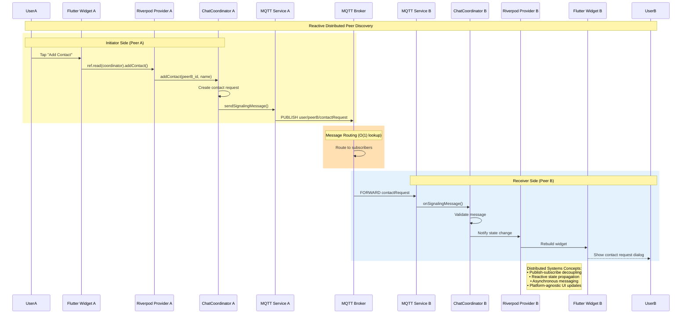
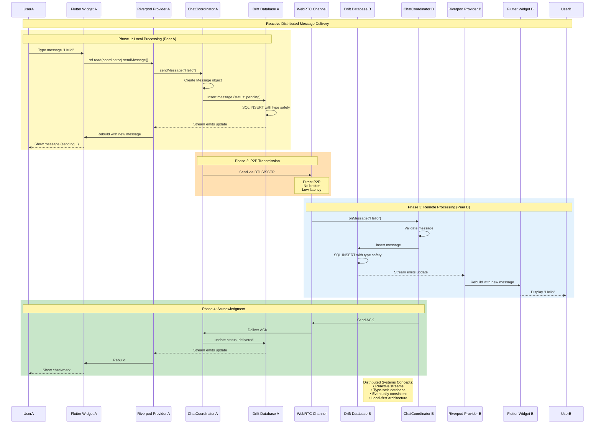
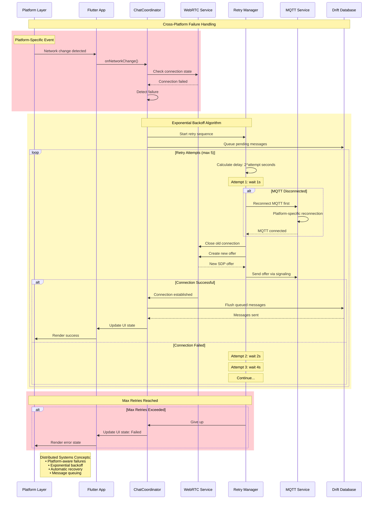
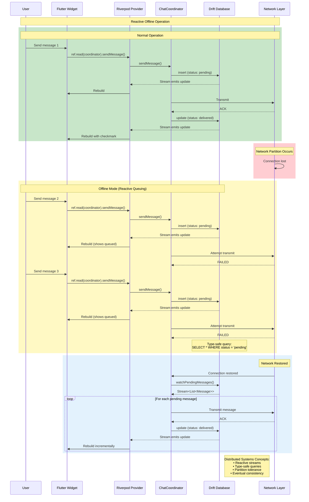
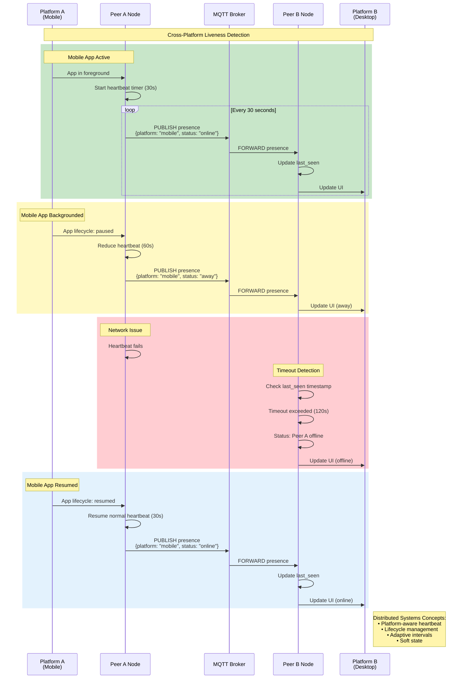

# Sequence Diagrams - Distributed Systems Interactions (Flutter)

## Academic Overview

This document presents sequence diagrams illustrating the temporal interactions between distributed system components in the Flutter P2P chat application. These diagrams demonstrate key distributed systems concepts including asynchronous communication, message passing, consensus protocols, and failure recovery across multiple platforms.

---

## Diagram 1: Cross-Platform System Initialization

### Concept: Platform-Agnostic Distributed Bootstrapping



**Distributed Systems Principles**:
- **Platform Independence**: Same distributed logic across platforms
- **Reactive Streams**: Drift streams propagate changes automatically
- **Asynchronous Operations**: Non-blocking initialization
- **Service Discovery**: MQTT topic subscription

---

## Diagram 2: Peer Discovery with Riverpod State Management

### Concept: Reactive Distributed Peer Discovery



**Distributed Systems Principles**:
- **Reactive Programming**: State changes trigger UI updates automatically
- **Publish-Subscribe**: Broker routes messages to subscribers
- **Loose Coupling**: Peers don't need direct addresses
- **Cross-Platform**: Same logic on all platforms

---

## Diagram 3: WebRTC Connection with Platform Channels

### Concept: Cross-Platform P2P Connection Establishment

```mermaid
sequenceDiagram
    participant PeerA as Peer A<br/>(Flutter)
    participant NativeA as Native Layer A<br/>(Platform-specific)
    participant SignalA as MQTT Signaling
    participant Broker as MQTT Broker
    participant SignalB as MQTT Signaling
    participant NativeB as Native Layer B<br/>(Platform-specific)
    participant PeerB as Peer B<br/>(Flutter)
    
    Note over PeerA,PeerB: Cross-Platform WebRTC Negotiation
    
    rect rgb(255, 249, 196)
        Note over PeerA,NativeA: Phase 1: Offer Creation
        PeerA->>NativeA: createOffer() via Method Channel
        NativeA->>NativeA: Platform WebRTC: createOffer()
        NativeA-->>PeerA: SDP offer
        PeerA->>PeerA: setLocalDescription(offer)
        PeerA->>SignalA: Send offer
        SignalA->>Broker: PUBLISH user/peerB/offer
    end
    
    rect rgb(255, 224, 178)
        Note over Broker: Reliable Delivery (QoS 1)
        Broker->>SignalB: FORWARD offer (with ACK)
    end
    
    rect rgb(227, 242, 253)
        Note over SignalB,PeerB: Phase 2: Answer Creation
        SignalB->>PeerB: Deliver offer
        PeerB->>PeerB: setRemoteDescription(offer)
        PeerB->>NativeB: createAnswer() via Method Channel
        NativeB->>NativeB: Platform WebRTC: createAnswer()
        NativeB-->>PeerB: SDP answer
        PeerB->>PeerB: setLocalDescription(answer)
        PeerB->>SignalB: Send answer
        SignalB->>Broker: PUBLISH user/peerA/answer
    end
    
    rect rgb(200, 230, 201)
        Note over Broker,PeerA: Phase 3: Answer Delivery
        Broker->>SignalA: FORWARD answer
        SignalA->>PeerA: Deliver answer
        PeerA->>PeerA: setRemoteDescription(answer)
    end
    
    rect rgb(255, 249, 196)
        Note over PeerA,PeerB: Phase 4: ICE Candidate Exchange
        
        par ICE Gathering (Parallel)
            PeerA->>NativeA: Gather ICE candidates
            NativeA-->>PeerA: ICE candidates
            PeerA->>Broker: PUBLISH candidates
            Broker->>PeerB: FORWARD candidates
            PeerB->>NativeB: addIceCandidate()
        and
            PeerB->>NativeB: Gather ICE candidates
            NativeB-->>PeerB: ICE candidates
            PeerB->>Broker: PUBLISH candidates
            Broker->>PeerA: FORWARD candidates
            PeerA->>NativeA: addIceCandidate()
        end
    end
    
    rect rgb(200, 230, 201)
        Note over PeerA,PeerB: Phase 5: Direct P2P Connection
        NativeA<->>NativeB: WebRTC Connection Established
        NativeA->>PeerA: onConnectionStateChange(connected)
        NativeB->>PeerB: onConnectionStateChange(connected)
    end
    
    Note right of NativeB: Distributed Systems Concepts:<br/>• Platform abstraction<br/>• Two-phase protocol<br/>• Reliable signaling<br/>• Cross-platform WebRTC
```

**Distributed Systems Principles**:
- **Platform Abstraction**: Method channels hide platform differences
- **Two-Phase Protocol**: Offer/answer handshake
- **Reliable Messaging**: QoS 1 guarantees delivery
- **Native Performance**: Platform-specific WebRTC implementation

---

## Diagram 4: Message Transmission with Drift Streams

### Concept: Reactive P2P Data Transfer with Type-Safe Database



**Distributed Systems Principles**:
- **Reactive Streams**: Drift streams automatically update UI
- **Type Safety**: Compile-time SQL verification
- **Local-First**: Save locally before transmission
- **Eventually Consistent**: Both databases converge

---

## Diagram 5: Platform-Aware Failure Recovery

### Concept: Cross-Platform Fault Tolerance



**Distributed Systems Principles**:
- **Platform Awareness**: Handles platform-specific network events
- **Failure Detection**: Multiple detection mechanisms
- **Exponential Backoff**: Prevents network flooding
- **Message Queuing**: Ensures eventual delivery

---

## Diagram 6: Polite Peer Pattern (Platform-Independent Consensus)

### Concept: Distributed Consensus Across Platforms

```mermaid
sequenceDiagram
    participant PeerA as Peer A<br/>(Android)
    participant PeerB as Peer B<br/>(iOS)
    
    Note over PeerA,PeerB: Cross-Platform Glare Resolution
    
    rect rgb(255, 249, 196)
        Note over PeerA,PeerB: Phase 1: Simultaneous Offers
        
        par Both create offers
            PeerA->>PeerA: createOffer() on Android
            PeerA->>PeerA: setLocalDescription(offer_A)
        and
            PeerB->>PeerB: createOffer() on iOS
            PeerB->>PeerB: setLocalDescription(offer_B)
        end
        
        par Exchange offers
            PeerA->>PeerB: Send offer_A
        and
            PeerB->>PeerA: Send offer_B
        end
    end
    
    rect rgb(255, 205, 210)
        Note over PeerA,PeerB: Phase 2: Glare Detection
        
        PeerA->>PeerA: Receive offer_B (unexpected)
        PeerA->>PeerA: GLARE DETECTED!
        
        PeerB->>PeerB: Receive offer_A (unexpected)
        PeerB->>PeerB: GLARE DETECTED!
    end
    
    rect rgb(200, 230, 201)
        Note over PeerA,PeerB: Phase 3: Platform-Independent Resolution
        
        PeerA->>PeerA: Compare: "alice" < "bob"
        PeerA->>PeerA: Role: POLITE (lower ID)
        PeerA->>PeerA: rollback() on Android
        PeerA->>PeerA: setRemoteDescription(offer_B)
        PeerA->>PeerA: createAnswer()
        PeerA->>PeerB: Send answer_A
        
        PeerB->>PeerB: Compare: "bob" > "alice"
        PeerB->>PeerB: Role: IMPOLITE (higher ID)
        PeerB->>PeerB: Ignore offer_A on iOS
        PeerB->>PeerB: Wait for answer
        PeerB->>PeerB: Receive answer_A
        PeerB->>PeerB: setRemoteDescription(answer_A)
    end
    
    rect rgb(227, 242, 253)
        Note over PeerA,PeerB: Phase 4: Cross-Platform Connection
        PeerA<->>PeerB: Android ↔ iOS connection established
    end
    
    Note right of PeerB: Distributed Systems Concepts:<br/>• Platform-independent consensus<br/>• Deterministic algorithm<br/>• No central coordinator<br/>• Cross-platform compatibility
```

**Distributed Systems Principles**:
- **Platform Independence**: Same algorithm on Android and iOS
- **Distributed Consensus**: No coordinator needed
- **Deterministic**: Same inputs → same outcome
- **Cross-Platform**: Works between any platform combination

---

## Diagram 7: Drift Reactive Querying During Network Partition

### Concept: Type-Safe Eventual Consistency



**Distributed Systems Principles**:
- **Reactive Streams**: UI updates automatically via Drift streams
- **Type Safety**: Compile-time SQL verification
- **Partition Tolerance**: Works during network split
- **Eventual Consistency**: Messages sync when connected

---

## Diagram 8: Cross-Platform Presence Detection

### Concept: Platform-Aware Liveness Detection



**Distributed Systems Principles**:
- **Platform Awareness**: Different heartbeat intervals per platform
- **Lifecycle Management**: Adapts to app state
- **Heartbeat Protocol**: Periodic liveness signals
- **Soft State**: Presence information expires

---

## Summary: Distributed Systems Concepts Illustrated

| Diagram | Primary Concept | Platform-Specific Considerations |
|---------|----------------|----------------------------------|
| **1. Initialization** | Cross-Platform Bootstrapping | Platform-specific WebSocket, storage paths |
| **2. Peer Discovery** | Reactive Publish-Subscribe | Riverpod state propagation |
| **3. Connection Setup** | Platform Abstraction | Method channels, native WebRTC |
| **4. Message Transfer** | Reactive Streams | Drift streams, type-safe queries |
| **5. Failure Recovery** | Platform-Aware Fault Tolerance | Network change detection |
| **6. Glare Resolution** | Platform-Independent Consensus | Works across any platform pair |
| **7. Message Queuing** | Type-Safe Eventual Consistency | Drift reactive queries |
| **8. Presence** | Platform-Aware Liveness | Lifecycle-based heartbeat |

---

## Academic Significance

These sequence diagrams demonstrate:

1. **Cross-Platform Distributed Systems**: Same distributed logic across 6 platforms
2. **Reactive Programming**: Stream-based state propagation
3. **Type Safety**: Compile-time verification of distributed operations
4. **Platform Abstraction**: Hiding platform differences from distributed logic
5. **Asynchronous Communication**: All interactions are non-blocking
6. **Message Passing**: No shared memory, only messages
7. **Distributed Coordination**: Consensus without central authority
8. **Fault Tolerance**: Automatic failure detection and recovery
9. **Eventual Consistency**: Temporary inconsistency for availability
10. **Network Transparency**: Complexity hidden from application

These patterns are fundamental to modern distributed systems and demonstrate how theoretical concepts apply across heterogeneous platforms.
