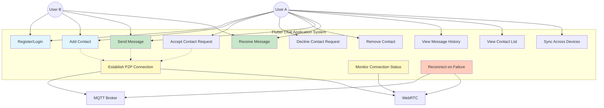
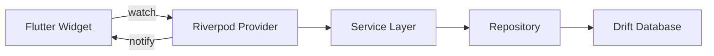
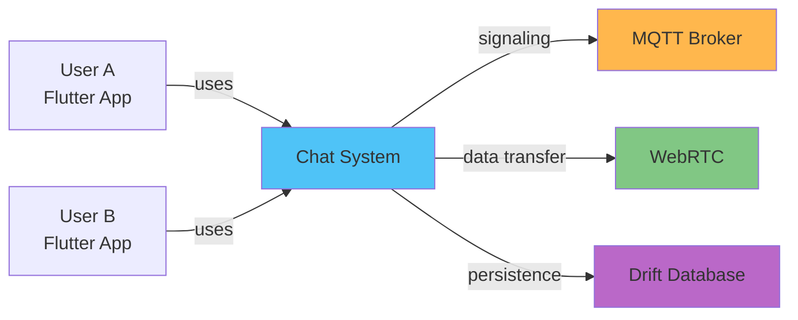

# Use Case Diagram - Flutter P2P Chat

## System Actors

1. **User A**: Primary user of the chat application
2. **User B**: Peer user communicating with User A
3. **MQTT Broker**: Signaling server for connection establishment
4. **WebRTC**: Peer-to-peer communication infrastructure

## Use Cases

## Use Case Descriptions

### UC1: Register/Login
- **Actor**: User
- **Description**: User enters their unique ID to join the chat system
- **Preconditions**: Flutter app installed and launched
- **Postconditions**: User is connected to MQTT broker and ready to chat
- **Flow**:
  1. User launches Flutter app
  2. User enters unique user ID
  3. System validates ID format
  4. System connects to MQTT broker
  5. System subscribes to user's topic
  6. User is marked as online
  7. Contact list is loaded from local database

### UC2: Add Contact
- **Actor**: User A
- **Description**: User A sends a contact request to User B
- **Preconditions**: User A is logged in
- **Postconditions**: Contact request is sent to User B
- **Flow**:
  1. User A taps "Add Contact" button
  2. Dialog appears for peer ID and name input
  3. User A enters peer ID and name
  4. System validates peer ID
  5. System sends contact request via MQTT
  6. Contact is saved to Drift database with "pending" status
  7. UI updates to show pending contact
  8. System waits for response

### UC3: Accept Contact Request
- **Actor**: User B
- **Description**: User B accepts a contact request from User A
- **Preconditions**: User B has received a contact request
- **Postconditions**: Both users have each other as contacts
- **Flow**:
  1. User B sees contact request notification
  2. User B views contact request dialog
  3. User B taps accept button
  4. System sends acceptance via MQTT
  5. Contact is updated in Drift database to "accepted"
  6. Contact appears in both users' lists
  7. System initiates WebRTC connection
  8. UI updates to show new contact

### UC6: Send Message
- **Actor**: User A
- **Description**: User A sends a message to User B
- **Preconditions**: WebRTC connection is established
- **Postconditions**: Message is delivered and persisted
- **Flow**:
  1. User A types message in TextField
  2. User A taps send button
  3. System creates Message object with UUID
  4. System saves to Drift database (status: sending)
  5. System sends via WebRTC data channel
  6. Message appears in chat with sending indicator
  7. System receives delivery confirmation
  8. Message status updated to delivered
  9. UI updates to show delivered status

### UC7: Receive Message
- **Actor**: User B
- **Description**: User B receives a message from User A
- **Preconditions**: WebRTC connection is established
- **Postconditions**: Message is received and persisted
- **Flow**:
  1. System receives data via WebRTC
  2. System parses JSON message
  3. System validates message format
  4. System saves to Drift database
  5. System emits message event
  6. Riverpod state updates
  7. UI rebuilds with new message
  8. System sends delivery acknowledgment
  9. Auto-scroll to latest message

### UC8: View Message History
- **Actor**: User
- **Description**: User views previous messages with a contact
- **Preconditions**: User has selected a contact
- **Postconditions**: Message history is displayed
- **Flow**:
  1. User taps on contact in sidebar
  2. System queries Drift database
  3. System retrieves messages via MessageRepository
  4. System creates reactive stream
  5. Messages display in ListView
  6. System auto-scrolls to latest
  7. UI shows message status indicators

### UC9: Establish P2P Connection
- **Actor**: System
- **Description**: System establishes WebRTC connection between peers
- **Preconditions**: Both users are online and have accepted contact
- **Postconditions**: WebRTC data channel is open
- **Flow**:
  1. System determines initiator (polite peer pattern)
  2. Initiator creates offer via WebRtcService
  3. Offer is sent via SignalingService (MQTT)
  4. Receiver sets remote description
  5. Receiver creates answer
  6. Answer is sent via MQTT
  7. ICE candidates are exchanged
  8. ICE candidates buffered if remote not set
  9. Connection is established
  10. Data channel opens
  11. Connection state updates
  12. UI shows "Connected" status

### UC10: Monitor Connection Status
- **Actor**: System
- **Description**: System continuously monitors connection health
- **Preconditions**: Connection is established
- **Postconditions**: Connection status is up-to-date
- **Flow**:
  1. System monitors RTCPeerConnectionState
  2. System monitors RTCIceConnectionState
  3. System sends periodic heartbeats
  4. Riverpod state notifies listeners
  5. UI updates status indicator
  6. System detects disconnections
  7. System triggers reconnection if needed

### UC11: Reconnect on Failure
- **Actor**: System
- **Description**: System automatically reconnects after connection failure
- **Preconditions**: Connection has failed
- **Postconditions**: Connection is re-established or max retries reached
- **Flow**:
  1. System detects connection failure
  2. System updates status to "reconnecting"
  3. System attempts reconnection with exponential backoff
  4. System re-establishes MQTT connection if needed
  5. System closes old WebRTC connection
  6. System creates new offer
  7. System re-establishes WebRTC connection
  8. System flushes pending messages from Drift
  9. System updates status to "connected"
  10. UI shows success notification

### UC13: Sync Across Devices
- **Actor**: User
- **Description**: User accesses chat from multiple devices
- **Preconditions**: Same user ID on multiple devices
- **Postconditions**: Messages and contacts synced
- **Flow**:
  1. User logs in on second device
  2. System loads local Drift database
  3. System connects to MQTT broker
  4. System receives messages from peers
  5. System updates local database
  6. UI shows latest messages
  7. Contacts remain consistent

## Flutter-Specific Features

### Riverpod State Management

### Reactive UI Updates
- **StreamProvider**: Real-time message updates
- **StateNotifier**: Connection state management
- **FutureProvider**: Async data loading
- **Provider**: Service instances

### Platform Integration
- **Android**: Material Design
- **iOS**: Cupertino widgets
- **Desktop**: Adaptive layouts
- **Web**: Responsive design

## Actor Relationships

## Use Case Priorities

### High Priority (MVP)
- UC1: Register/Login
- UC6: Send Message
- UC7: Receive Message
- UC8: View Message History
- UC9: Establish P2P Connection

### Medium Priority
- UC2: Add Contact
- UC3: Accept Contact Request
- UC10: Monitor Connection Status
- UC11: Reconnect on Failure

### Low Priority (Nice to Have)
- UC4: Decline Contact Request
- UC5: Remove Contact
- UC12: View Contact List
- UC13: Sync Across Devices
